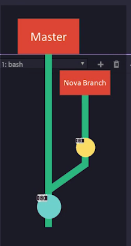

# Dominando GIT E GITHUB

### #001 - Introdução ao Git e GitHub: Instalação, Conceitos Básicos e Fluxo de Trabalho Inicial

Em Resumo :  

- **`git init`** cria o repositório Git.
- **`git add`** prepara os arquivos para o commit.
- **`git status`** mostra o estado atual do repositório e das alterações.
- `git log` exibe o histórico de commits em um repositório Git, mostrando detalhes como o ID do commit, o autor, a data e a mensagem associada a cada commit.
- **`git checkout <código>`**: Usado para mudar de branch ou restaurar arquivos de commits específicos.
- **`git checkout master`**: Especificamente usado para mudar para a branch `master` (ou `main`, dependendo do repositório.
1. **`git init`**:
    - Inicializa um novo repositório Git em um diretório local.
    - Cria um diretório oculto chamado `.git`, onde o Git armazenará todas as informações sobre o repositório.
    - Permite começar a versionar o código a partir de um diretório que não estava sendo controlado pelo Git.
2. **`git add`**:
    - Adiciona arquivos ou alterações ao "índice" (área de preparação) do Git, preparando-os para o próximo commit.
    - Pode ser usado para adicionar arquivos específicos (`git add arquivo.txt`) ou para adicionar todos os arquivos modificados (`git add .`).
3. **`git status`**:
    - Exibe o estado atual do repositório.
    - Mostra quais arquivos foram modificados, adicionados ou deletados, e se estão prontos para ser comitados ou ainda precisam ser adicionados com `git add`.
    - Também informa sobre a branch atual e outros detalhes importantes sobre o repositório.
4. **`git log`**: Exibe o histórico completo de commits. 
    - **`git log --oneline`**: Mostra um resumo mais compacto, exibindo um hash curto e a mensagem do commit em uma linha.
    - **`git log --graph`**: Exibe o histórico de commits com uma representação gráfica de como os branches se unem e se dividem.
    - 
    
    Os comandos `git checkout <código>` e `git checkout master` são usados no Git para manipular e navegar entre branches ou restaurar arquivos. Aqui está o que cada um faz:
    
    ### **1. `git checkout <código>`**:
    
    - **Objetivo**: Este comando é usado para mudar para uma branch específica ou restaurar um arquivo de um commit específico.
    - **Parâmetro `<código>`**: Pode ser um nome de branch, um hash de commit ou até mesmo um caminho de arquivo.
        
        Exemplos de uso:
        
        - **Trocar para uma branch específica**:
            
            `git checkout <nome-da-branch>`
            Exemplo: `git checkout feature-xyz`
            
        - **Restaurar um arquivo de um commit específico**:
        `git checkout <hash-do-commit> <caminho-do-arquivo>`
        Exemplo: `git checkout abc1234 -- index.html`
    
    ### **2. `git checkout master`**:
    
    - **Objetivo**: Este comando é usado para mudar para a branch `master`, que é comumente a branch principal de um repositório Git. Porém, em muitos repositórios modernos, a branch principal pode ser chamada de `main` ao invés de `master`.
        
        Exemplo:
        
        - Para voltar para a branch principal `master`:
            
            ```bash
            bash
            Copiar código
            git checkout master
            
            ```
            
    

### #002 - Fundamentos de Git e GitHub: Configuração, Versionamento e Colaboração em Projetos

- O arquivo **`.gitignore`** deve ser colocado no diretório raiz do repositório Git.
- Ele contém uma lista de **padrões** (por exemplo, nomes de arquivos ou diretórios) que o Git irá ignorar.
- Arquivos ou diretórios que correspondem aos padrões no `.gitignore` não são adicionados ao repositório nem são rastreados pelo Git.

### Como adicionar um arquivo `.gitignore`:

1. Crie um arquivo chamado `.gitignore` na raiz do seu repositório.
2. Adicione os padrões de arquivos/diretórios que você quer ignorar.
3. Adicione e comite o arquivo `.gitignore` no repositório, para que outros colaboradores também usem a mesma configuração.

### Observações:

- Arquivos que já foram rastreados pelo Git antes de serem adicionados ao `.gitignore` continuarão sendo rastreados. Para parar de rastrear um arquivo, você deve removê-lo com `git rm --cached <arquivo>`.
- O `.gitignore` pode ser personalizado para diferentes projetos, dependendo dos arquivos e ferramentas que você está usando (por exemplo, `.log` para logs, `node_modules/` para dependências do Node.js).

Em resumo, o **`.gitignore`** ajuda a manter seu repositório limpo, evitando que arquivos desnecessários ou confidenciais sejam versionados.

**`git clone`** :  O comando **`git clone`** é utilizado para **baixar** um repositório remoto e criar uma cópia local dele no seu computador, com todos os arquivos e histórico do projeto, pronto para começar a trabalhar.

### **Resumo do fluxo**:

1. **`git clone`**: Baixa o repositório remoto.
2. **`git add <arquivo>`**: Adiciona as alterações à área de preparação.
3. **`git status`**: Verifica o estado do repositório e confirma se tudo está pronto para o commit.
4. **`git commit -m "new update"`**: Cria um commit com a mensagem "new update".
5. **`git push`**: Tenta enviar as alterações para o repositório remoto, mas ocorre um erro devido à falta de configuração de identidade.
6. **`git config --global user.name`** e **`git config --global user.email`**: Configura o nome e o e-mail do usuário.
7. **`git push`**: O push agora é bem-sucedido após a configuração das credenciais.
8. **`git pull` :** O comando  é utilizado para **atualizar** seu repositório local com as últimas mudanças do repositório remoto e mesclar essas alterações na branch atual. 
9. `git log` : exibe o histórico de commits em um repositório Git, mostrando detalhes como o ID do commit, o autor, a data e a mensagem associada a cada commit.

Esse fluxo é bastante comum no uso diário do Git para trabalhar com repositórios locais e remotos, garantindo que suas alterações sejam corretamente registradas e enviadas para o repositório compartilhado.

### #003 - Trabalhando com Branches no Git: Criação, Merge e Resolução de Conflitos

- `git branch <new>` → Cria uma nova branch chamada `<new>`.
- `main` → Nome padrão da branch principal.
- `git checkout main`  → retorna para branch prinicipal
- Mescla (`merge`) as alterações da branch `nova-branch` na branch atual.
- Deve ser executado estando na branch de destino (ex.: `main`)
- git log --graph
**O que ele faz?**
- Exibe o histórico de commits em formato gráfico, mostrando as ramificações e merges do repositório.
- Ajuda a visualizar a estrutura do desenvolvimento do projeto.

**Exemplo de uso:**

```bash

git log --graph --oneline --all --decorate

```

🔹 **`--oneline`** → Exibe commits em uma única linha.

🔹 **`--all`** → Mostra o histórico de todas as branches.

🔹 **`--decorate`** → Mostra referências como HEAD, branches e tags.

Se estiver na branch `main` e quiser criar `branch2`:

```bash
git checkout -b branch2

```

git merge <branch> → essa branch vai para rota principal. 



```bash
git push origin <branch>

```

✅ Envia a branch `<branch>` para o repositório remoto `origin`.

✅ Se a branch não existir no remoto, ela será criada.

✅ Use `-u` para definir o upstream e facilitar futuros `push`.

**Exemplo:**

```bash
bash
Copiar código
git push -u origin minha-branch

```

Agora, nos próximos commits, basta usar:

```bash
bash
Copiar código
git push

```

```bash
git branch -d nova-branch

```

### #excluir branch

✅ **Exclui a branch `nova-branch` localmente**, **somente se ela já foi mesclada**.

✅ Se a branch **não estiver mesclada**, o Git impedirá a exclusão para evitar perda de dados.

### **Forçar a exclusão**

Se quiser apagar a branch **mesmo sem mesclá-la**, use:

```bash
bash
Copiar código
git branch -D nova-branch

```

🔹 **Atenção!** Isso removerá a branch **sem possibilidade de recuperação** via Git.

### **Excluir a branch também no repositório remoto**

Após remover localmente, exclua no remoto com:

```bash
bash
Copiar código
git push origin --delete nova-branch

```

### #004 - Gerenciamento de Issues e Branches Remotas no Git e GitHub

### **Resumo**

```bash
bash
Copiar código
git commit -m "Alteração realizada closes #2"

```

✅ **Cria um commit** com a mensagem `"Alteração realizada"`

✅ **Fecha automaticamente a issue #2** no GitHub/GitLab ao fazer `push`

### **Explicação**

- `closes #2`: Indica que a issue **#2** será fechada automaticamente quando esse commit for enviado ao repositório remoto.
- Funciona em plataformas como **GitHub, GitLab e Bitbucket**.

### **Exemplo de Uso**

1. Fazer mudanças no código.
2. Adicionar os arquivos modificados:
    
    ```bash
    bash
    Copiar código
    git add .
    
    ```
    
3. Criar o commit e vincular à issue:
    
    ```bash
    bash
    Copiar código
    git commit -m "Corrigido bug no login closes #2"
    
    ```
    
4. Enviar para o repositório remoto:
    
    ```bash
    bash
    Copiar código
    git push origin minha-branch
    
    ```
    

Após o push, a issue **#2** será fechada automaticamente. 🚀

###